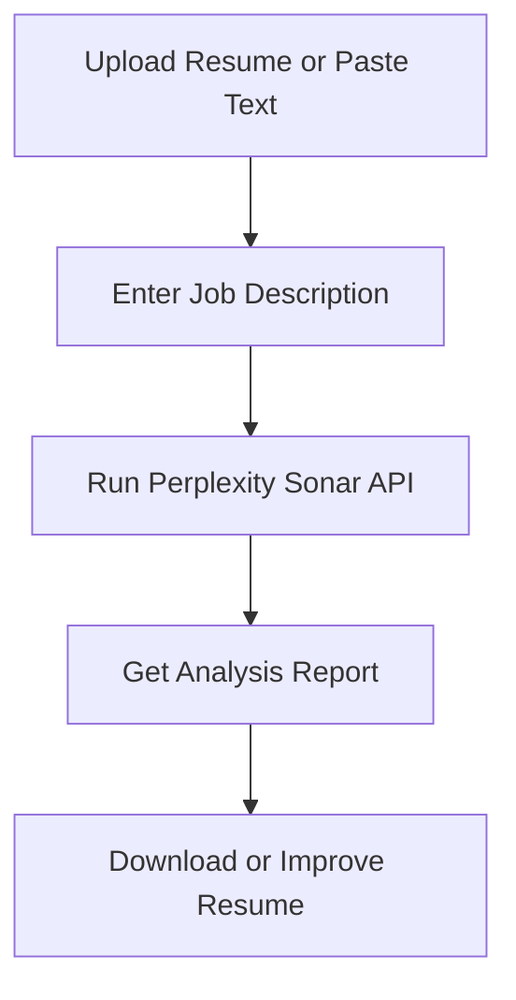

# Resume-CV-Analyser
> 🚀 Built by [Siddiha](https://github.com/Siddiha) for the **Perplexity API Hackathon**

A smart resume analysis tool built with Streamlit, Python, and Perplexity's Sonar API — perfect for candidates and recruiters who want a competitive edge.


---

## Extensive Features

- Upload or paste resumes (PDF or text)
-  Uses **Perplexity Sonar API** for deep AI-driven insights
-  Compares against real job descriptions
-  Gives **keyword analysis**, **skill match score**, **ATS tips**, and **personalized suggestions**
-  Download the resume analysis instantly
-  Clean, fast, Streamlit-based UI

---

##  How it Works (Live Flow)



---

## 🔧 Tech Stack

| Tool | Role |
|------|------|
| 🐍 Python | Core backend |
| 📚 Streamlit | Frontend UI |
| 📦 PyPDF2 | PDF text extraction |
| 🔐 dotenv | Environment management |
| 🌐 Perplexity Sonar API | NLP analysis |
<!-- | 💻 HTML/CSS (via Streamlit) | UI rendering | -->

---

##  File Structure

```
Resume-CV-Analyser/
├── venv/                  # Virtual environment
├── app.py                 # Main Streamlit application
├── key.env                # API keys stored securely
├── requirements.txt       # Dependencies
└── README.md              # This documentation
```

---

##  Setup Instructions

1. **Clone the Repository**

```bash
git clone https://github.com/Siddiha/Resume-CV-Analyser.git
cd Resume-CV-Analyser
```

2. **Create & Activate Virtual Environment**

```bash
python -m venv venv
source venv/bin/activate  # On Windows: venv\Scripts\activate
```

3. **Install Dependencies**

```bash
pip install -r requirements.txt
```

4. **Add Your Perplexity API Key**

Create a `.env` file or edit `key.env` and add:

```env
PERPLEXITY_API_KEY=your_perplexity_api_key_here
```

Or enter it in the Streamlit app when prompted.

5. **Run the Streamlit App**

```bash
streamlit run app.py
```

---

## How to Use

1. Input your Perplexity API key (optional if already in `.env`)
2. Paste the job description on the left
3. Upload your resume as PDF or paste text directly
4. Hit **Analyze Resume**
5. View results, download insights, and update your resume accordingly!

---

## What the Analysis Includes

-  Keyword Match Analysis
-  Missing Skills Report
-  Skills Alignment Score (out of 10)
-  Experience Relevance Review
-  Resume Improvement Suggestions
-  ATS Optimization Tips

---

## API Usage Note

This tool integrates directly with the [Perplexity API](https://www.perplexity.ai/api).  
You will need a valid API key to use it — store it securely via `.env` or Streamlit secrets.

---

##  Target Audience

- Job Seekers who want tailored resume feedback 
- Career Coaches and Resume Experts
- HR & Recruitment Teams
  

---

## Requirements Needed

```txt
streamlit
python-dotenv
requests
PyPDF2
```

Install using:

```bash
pip install -r requirements.txt
```

---


## 🛡 License

This project is licensed under the [MIT License](https://opensource.org/licenses/MIT)

---

## ❤️ Made with love by [Siddiha](https://github.com/Siddiha)

